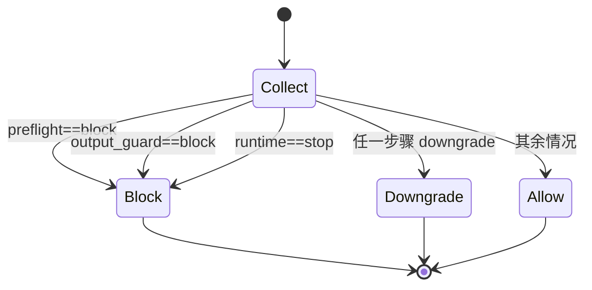

# TrinityGuard Self-Guard 架构说明

## 1. 目录与组件
`skills/trinityguard-self-guard` 核心结构：
1. 根入口：`SKILL.md`
2. 安装与验收：`install/install_skill_local.py`、`install/verify_install.py`
3. 执行核心：`shared/scripts/self_guard_runtime_hook_template.py`
4. 事件查询：`shared/scripts/query_guard_events.py`
5. 策略配置：`shared/references/runtime_policy.{template|balanced|strict|permissive}.json`
6. 事件契约：`shared/references/guard_event.schema.json`

## 2. 触发与执行链路
触发条件（任一满足）：
1. 命令执行 / 文件修改 / 工具调用 / 网络调用
2. 解释型回答但上下文含敏感信息
3. 仓库规则要求每轮输出前强制 self-guard

执行顺序：
1. `infer_sensitivity`
2. `preflight_decision`
3. `runtime_decision`
4. `output_guard`
5. `decide_final_action`

输出产物：
1. 主日志（JSONL）：`.codex/logs/self_guard_events.jsonl`
2. 会话状态：`.codex/logs/.self_guard_state/<session>.json`
3. 可选摘要：通过 `--out` 输出单轮 summary JSON

## 3. final_action 状态机

## 4. 事件字段（核心）
每条事件至少包含：
1. `ts`
2. `trace_id`
3. `session_id`
4. `turn_id`
5. `event_type`
6. `decision`
7. `risk_level`
8. `reason_codes`
9. `matched_rules`

`final_decision` 事件额外包含：
1. `final_action`
2. `retention`
3. `residual_risks`
4. `audit_notes`

