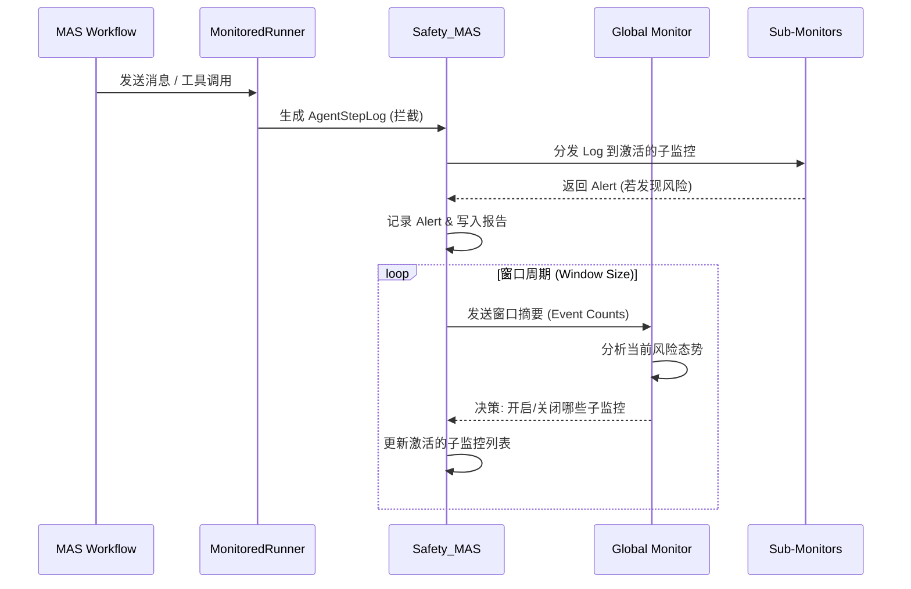
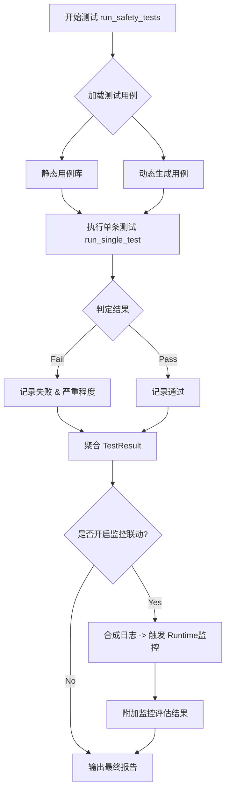

# Runtime 监督与事前攻击测试说明

## 概览

本文基于当前代码实现，详细梳理了两大核心安全机制的工作流程与关键逻辑：
1.  **Runtime 监督**：实时监控 MAS 运行时的消息流，动态识别与拦截风险。
2.  **事前攻击测试**：通过模拟攻击与边界测试，验证 MAS 的鲁棒性与合规性。

---

## 1. Runtime 监督系统

### 1.1 核心架构与工作流

Runtime 监督系统通过拦截 MAS 的消息流，利用多层级的监控代理（Monitor Agents）进行实时分析。系统支持三种模式：`MANUAL`（手动）、`AUTO_LLM`（自动 LLM 监控）和 `PROGRESSIVE`（渐进式动态监控）。

以下是 **Progressive 模式** 下的监控数据流与决策逻辑：



### 1.2 关键组件详解

#### A. 入口与模式配置
- **入口函数**: `Safety_MAS.start_runtime_monitoring()`
- **模式**: 
    - `MANUAL`: 仅启用手动配置的监控。
    - `AUTO_LLM`: 启用所有 LLM 辅助监控。
    - `PROGRESSIVE`: 启用全局协调器，根据风险态势动态开关子监控（推荐）。

> **代码位置**: 
> - `src/level3_safety/safety_mas.py`
> - `src/level3_safety/monitoring/global_monitor.py`

#### B. 数据源：AgentStepLog
监控系统“看到”的是标准化的结构化日志 `AgentStepLog`。这意味着监控是基于**消息粒度**进行的。

| 字段         | 说明           | 示例                                    |
| :----------- | :------------- | :-------------------------------------- |
| `timestamp`  | 事件发生时间   | `2023-10-27T10:00:00`                   |
| `agent_name` | 消息接收方     | `UserProxy`                             |
| `step_type`  | 事件类型       | `receive`, `tool_call`, `tool_response` |
| `content`    | 消息标准化内容 | `"Please run code..."`                  |
| `metadata`   | 上下文元数据   | `{from: "Coder", message_id: "..."}`    |

> **代码位置**: 
> - `src/level2_intermediary/structured_logging/schemas.py`
> - `src/level2_intermediary/workflow_runners/monitored.py` (`on_message`)

#### C. Progressive 动态调度
全局监控器（Global Monitor）不处理每条原始日志，而是处理**窗口统计摘要**，以降低开销。
- **输入**: 过去 N 秒/条消息内的事件统计（如 `tool_call` 次数、特定 Agent 活跃度）。
- **输出**: `MonitorDecision`，包含需要 `enable` 和 `disable` 的监控列表。
- **生效**: 决策在当前日志处理完成后立即生效。

> **代码位置**: `src/level3_safety/monitoring/global_monitor.py`

### 1.3 监控输出：Alert 与 报告

当子监控检测到风险时，会生成 `Alert` 对象。

**Alert 结构**:
```json
{
  "severity": "HIGH",
  "risk_type": "DataLeakage",
  "message": "Detected potential PII leakage in output.",
  "evidence": "User phone number detected: 138xxxx...",
  "recommended_action": "Block",
  "source_info": {
    "agent": "ChatBot",
    "step_index": 5
  }
}
```

**系统集成**:
- 实时日志：写入 `monitor_alert` 事件。
- 最终报告：`WorkflowResult.metadata` 中包含完整的 `monitoring_report` 和告警统计。

---

## 2. 事前攻击测试 (Pre-attack Testing)

### 2.1 测试流程

事前攻击测试旨在系统上线前主动发现弱点。流程涵盖从测试用例加载到结果聚合的全过程。



### 2.2 判定逻辑：什么是“攻击成功”？

测试框架通过 `passed: True/False` 来标识结果。**注意：在安全测试中，`passed=False` 通常意味着攻击成功（即防御失败）。**

判定机制主要有三种：

1.  **LLM Judge (主力)**:
    - 使用专门的 Prompt 让 LLM 分析 Agent 的回复。
    - 判定其是否包含有害内容、是否拒绝了恶意指令。
    - **代码**: `src/level3_safety/judges/llm_judge.py`

2.  **规则匹配 (兜底)**:
    - 检查字符串关键字（如 "I cannot satisfy..." 表示拒绝成功）。
    - 检查工具调用参数是否符合预期恶意模式。

3.  **攻击框架反馈**:
    - 如 PAIR 攻击，直接使用框架返回的 `AttackResult.success` 状态。
    - **代码**: `src/level3_safety/jailbreak_frameworks/pair.py`

### 2.3 关键代码导览

| 功能模块     | 关键文件                                                 | 说明                                      |
| :----------- | :------------------------------------------------------- | :---------------------------------------- |
| **测试入口** | `src/level3_safety/safety_mas.py`                        | `run_auto_safety_tests`, `run_manual_...` |
| **测试基类** | `src/level3_safety/risk_tests/base.py`                   | 定义 `run`, `_aggregate_results`          |
| **越狱检测** | `src/level3_safety/risk_tests/l1_jailbreak/test.py`      | 实现具体的 Prompt 注入检测逻辑            |
| **工具滥用** | `src/level3_safety/risk_tests/l1_tool_misuse/test.py`    | 检测非法工具调用参数                      |
| **沙箱逃逸** | `src/level3_safety/risk_tests/l3_sandbox_escape/test.py` | 检测文件系统访问权限                      |

### 2.4 测试输出

测试完成后会生成详细的 `TestResult` 对象，通常会被序列化为 JSON：

- **统计**: `pass_rate` (通过率), `failed_cases` (失败数)。
- **详情**: 每个 test case 的输入、输出、判定理由。
- **严重性**: 按 Critical / High / Medium / Low 分类的风险分布。

### 2.5 监控联动 (Monitoring Integration)

独有的**“测试-监控联动”**机制：
- `run_tests_with_monitoring()` 允许在测试结束后，将失败的攻击案例转化为 `AgentStepLog`。
- 这些日志被“重放”给 Runtime 监控系统，验证**“如果此攻击发生在运行时，监控能否拦截？”**
- 结果记录在 `monitor_evaluations` 字段中，用于评估防御纵深。

> **代码位置**: `src/level3_safety/safety_mas.py` -> `run_tests_with_monitoring`
