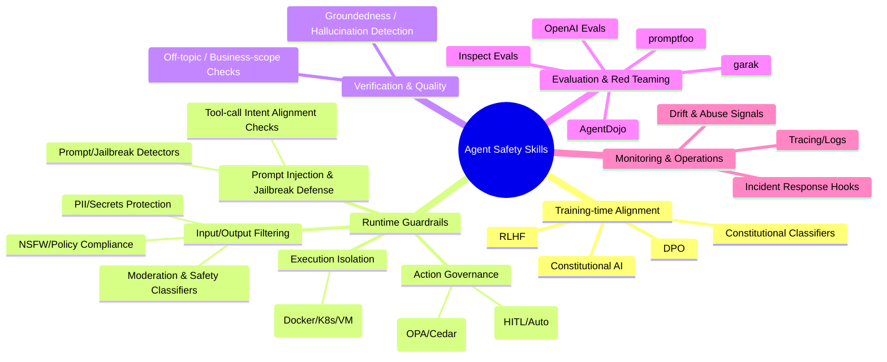

# 通用 Agent Safety Skills 调研综述

## 执行摘要

随着 Agentic AI（具备规划、调用工具、长程执行能力的 LLM 系统）在研发、客服、数据分析、办公自动化与网络安全等场景落地，**“安全（safety）技能（skills）”正在从单一的内容审核（moderation）扩展为覆盖训练、运行时、工具调用与运维监控的分层能力栈**：既要防“有害内容”，也要防“越权动作”“提示注入（prompt injection）”“隐私/密钥泄漏”“幻觉与不可信行动”。这一趋势在多家厂商与开源生态中表现为：可配置护栏框架（Guardrails）、工具调用级审批与沙箱（sandboxing）、专用注入/越狱检测器、以及可观测性与红队评测工具的组合式部署。citeturn20view2turn22view0turn31view0turn32view0turn28search1

本综述将“safety skills”定义为：**可复用、可组合、可部署到 Agent 系统生命周期任何环节的安全能力模块**（训练对齐、输入/输出过滤、工具调用治理、执行环境隔离、评测与监控等）。在近五年中，业界逐步形成共识：单点过滤很难对抗自适应攻击与复杂工作流风险；更有效的是“分层防御（defense-in-depth）”，尤其是将安全检查下沉到**工具调用前后**（防止不相关/越权 tool call 与工具返回数据的注入劫持），并结合“人类在环（HITL）审批”与“强隔离沙箱”来控制副作用。citeturn22view0turn31view0turn30view0

本文交付内容包括：面向研究者可直接用作 Survey 的 Markdown（含目录、总表、分类与流程 mermaid、对比分析、风险与缓解策略、以及附录逐条条目）。如某些技能公开资料不足，则在相应字段标注“未说明”。

**目录（TOC）**

- 执行摘要
- 研究方法与检索来源
- Safety skills 总览与列表
- 综合分析
- 结论与未来研究方向
- 附录：每个 skill 的详细条目

## 研究方法与检索来源

本调研以“通用 agent safety”为范围（不限定医疗/金融/政务等垂直领域），覆盖学术论文、开源项目与行业实践。检索原则如下：

研究对象界定为“Agent Safety Skills”，覆盖训练与运行时两类：训练侧包含偏好对齐与宪法式对齐（如 RLHF、DPO、Constitutional AI）；运行侧包含输入/输出/工具调用护栏、内容审核分类器、提示注入与越狱检测、PII/密钥防泄漏、策略引擎授权、沙箱隔离、人类审批、红队评测与安全监控等。citeturn2search2turn46search0turn2search1turn31view0turn32view0turn28search1

来源优先级按“原始/官方 > 可验证的开源仓库 > 行业白皮书/官方博客 > 二次解读”排序。典型高优先来源包括：OpenAI / AWS / Microsoft / Google / NVIDIA / Meta 的官方文档与模型卡，UK AISI（英国 AI 安全研究所）Inspect 系列官方文档与开源仓库，以及 arXiv/ACL/EMNLP 等论文。citeturn35search3turn14search1turn14search3turn35search2turn36search2turn41view0turn29search3

检索语言以中文为主并补充关键英文资料；对于中文资料较少的主题（如 tool approval、sandboxing、prompt injection benchmark），以英文原文为主，并在文本中标注来源类型（论文/仓库/文档/博客）。citeturn31view0turn32view0turn28search1

时间范围不限但优先近五年。本文成稿时间为 2026-03-06（Asia/Singapore），对可能快速变化的云服务功能（如内容安全 API、guardrails 产品形态、评测工具版本）尽量引用官方文档的最新页面。citeturn43search0turn18search1turn33search2

## Safety skills 总览与列表

下图给出本文采用的“安全技能分层视图”。（提示：这是分类框架，不是唯一标准。）



### 已有 safety skills 列表（总表）

> 说明：表中“实现方式/依赖”尽量写到可复现层面（模型/工具/规则/运行时），但对闭源 SaaS 的内部实现以“未说明”处理。

| 名称                                                                   | 简短描述                                                                       | 主要功能                                                                                                                                                                      | 适用场景                                                                    | 实现方式/依赖（模型/工具/规则）                                                                                            | 开源/闭源                      | 主要链接                                                                                                                                                                                                                                                                                                                                       |
| ---------------------------------------------------------------------- | ------------------------------------------------------------------------------ | ----------------------------------------------------------------------------------------------------------------------------------------------------------------------------- | --------------------------------------------------------------------------- | -------------------------------------------------------------------------------------------------------------------------- | ------------------------------ | ---------------------------------------------------------------------------------------------------------------------------------------------------------------------------------------------------------------------------------------------------------------------------------------------------------------------------------------------- |
| OpenAI Agents SDK Guardrails                                           | Agents SDK 的输入/输出/工具级护栏与 Tripwire 机制                              | 在 agent 执行关键点阻断/放行；支持并行 vs 阻塞；支持 tool guardrails 包围工具调用                                                                                             | 多智能体工作流、工具密集型 agent、需要控制副作用与成本的生产系统            | 自定义 guardrail 函数返回 `GuardrailFunctionOutput`；tripwire 触发抛异常；工具级 guardrails 用于每次函数工具调用前后检查 | 开源（MIT）                    | `https://openai.github.io/openai-agents-python/guardrails/`；`https://github.com/openai/openai-agents-python` citeturn23search10turn19search1turn13search8                                                                                                                                                                       |
| OpenAI Guardrails（Python/TypeScript）                                 | 可配置安全框架：替换 OpenAI 客户端后自动运行多阶段检查                         | preflight/input/output pipeline；内置 Moderation、PII、URL Filter、Jailbreak、Prompt Injection、Hallucination、Off-topic、Custom Prompt Check 等；可统计 guardrail token 消耗 | OpenAI API 或兼容 API 的 LLM 应用；需要“策略配置 + 结果可追溯 + 回归测试” | 开源 SDK（Python/TS）；向导生成配置；部分检查调用 OpenAI Moderation/FileSearch/LLM；PII 使用 Presidio                      | 开源（MIT）+ 向导/部分服务闭源 | `https://guardrails.openai.com/`；`https://openai.github.io/openai-guardrails-python/`；`https://github.com/openai/openai-guardrails-python`；`https://openai.github.io/openai-guardrails-js/` citeturn20view2turn20view1turn19search7turn25view0                                                                          |
| OpenAI Moderation API / omni-moderation-latest                         | OpenAI 免费内容审核模型（文本+图像）                                           | 有害内容分类与分数；用于输入/输出过滤与风控                                                                                                                                   | 通用内容安全：UGC、客服、聊天、社区、创作平台                               | OpenAI Moderation endpoint；模型别名 `omni-moderation-latest`（支持图像输入）                                            | 闭源（API 服务）               | `https://developers.openai.com/api/docs/models/omni-moderation-latest`；`https://platform.openai.com/api/docs/guides/moderation` citeturn35search3turn35search9                                                                                                                                                                    |
| OpenAI Function Calling 安全约束                                       | 工具调用层的结构化与允许列表约束                                               | 用 JSON Schema 约束参数；通过 allowed/choice 控制可调用工具；降低解析错误与越权调用风险                                                                                       | Agent 工具调用（金融操作、删除数据、外部通信等高风险工具）                  | OpenAI function calling；结构化输出与 schema 约束（含 strict 模式等）；开发者侧需做参数校验与权限控制                      | 闭源（API 能力）               | `https://developers.openai.com/api/docs/guides/function-calling` citeturn12view0                                                                                                                                                                                                                                                       |
| OpenAI Code Interpreter Tool Sandbox                                   | 托管工具：在沙箱环境执行 Python                                                | 在 sandboxed environment 运行 Python；处理文件；生成图表/结果文件；减少“任意代码执行”对宿主的风险                                                                           | 数据分析 agent、编程/数学 agent、需要可控代码执行的工具链                   | OpenAI Code Interpreter 工具（沙箱执行环境）                                                                               | 闭源（平台工具）               | `https://developers.openai.com/api/docs/guides/tools-code-interpreter` citeturn43search0turn43search8                                                                                                                                                                                                                                |
| AWS Bedrock Guardrails                                                 | Bedrock 的统一护栏服务                                                         | 内容过滤、敏感信息过滤（PII/regex）、否定主题（denied topics）、词/短语过滤                                                                                                   | 在多模型（Claude/Llama 等）上统一安全策略与合规拦截                         | Bedrock Guardrails 控制台/API；可配置 denied topics 与 word filters 等组件                                                 | 闭源（SaaS/API）               | `https://docs.aws.amazon.com/bedrock/latest/userguide/guardrails.html`；`https://docs.aws.amazon.com/bedrock/latest/userguide/guardrails-denied-topics.html`；`https://docs.aws.amazon.com/bedrock/latest/userguide/guardrails-word-filters.html` citeturn14search1turn33search2turn33search7                                  |
| Azure AI Content Safety Suite                                          | Azure 内容安全套件（含 Prompt Shields、Groundedness、Protected Material 等）   | 文本/图像有害内容检测；Prompt Shields 抗提示注入；Groundedness 检测与（部分场景）纠正；受保护材料检测降低版权风险                                                             | 企业合规、RAG、内容平台、代码生成与版权风险控制                             | Azure Content Safety API/Studio；模块化能力（Prompt Shields、Groundedness、Protected Material）                            | 闭源（SaaS/API）               | `https://learn.microsoft.com/en-us/azure/ai-services/content-safety/`；`https://learn.microsoft.com/en-us/azure/ai-services/content-safety/concepts/groundedness`；`https://learn.microsoft.com/en-us/azure/ai-services/content-safety/concepts/protected-material` citeturn16search16turn16search0turn33search0turn2search0 |
| Google Vertex AI/Gemini Safety Filters                                 | Google 生成式 API 的安全过滤与阈值设置                                         | 按伤害类别配置 blocking thresholds；对输出进行安全过滤                                                                                                                        | Gemini/Vertex AI 上的生成式应用内容治理                                     | Vertex AI Safety Filters + Gemini Safety settings（配置项与阈值）；内部实现未说明                                          | 闭源（SaaS/API）               | `https://docs.cloud.google.com/vertex-ai/generative-ai/docs/multimodal/configure-safety-filters`；`https://ai.google.dev/gemini-api/docs/safety-settings` citeturn14search2turn14search6                                                                                                                                           |
| Google ShieldGemma Safety Classifiers                                  | 基于 Gemma 的开源权重安全分类器（文本/图像）                                   | 判断输入/输出是否违反安全政策（多类 harm）；可用于过滤与数据清洗                                                                                                              | 自托管 moderation、训练数据清洗、输入/输出过滤器                            | ShieldGemma（文本/图像）+ Transformers/HF；权重开放但受条款约束                                                            | 开放权重（许可）               | `https://ai.google.dev/responsible/docs/safeguards/shieldgemma`；`https://huggingface.co/google/shieldgemma-2b` citeturn35search2turn35search1                                                                                                                                                                                     |
| Meta Llama Guard                                                       | 基于 Llama 的输入/输出安全分类器（LLM 形式）                                   | 对 prompt/response 输出 safe/unsafe + 子类；可基于概率阈值决策                                                                                                                | 自托管内容审核；可适配不同政策 taxonomy                                     | Llama-Guard（Llama 2 7B safeguard）；基于首 token 概率得分并阈值化；权重需接受 Meta 许可                                   | 开放权重（许可）               | `https://github.com/meta-llama/PurpleLlama/tree/main/Llama-Guard` citeturn40view0turn41view0                                                                                                                                                                                                                                         |
| Meta Llama Prompt Guard 2                                              | prompt injection + jailbreak 二分类检测器（86M/22M）                           | 识别 prompt attack（恶意覆盖指令）；可多语言；支持长输入分段扫描                                                                                                              | RAG/工具调用/多代理系统中的提示攻击检测                                     | Transformers text-classification；512-token 上下文；训练与损失设计用于降低 OOD 误报                                        | 开放权重（许可）               | `https://huggingface.co/meta-llama/Llama-Prompt-Guard-2-86M` citeturn40view1                                                                                                                                                                                                                                                           |
| NVIDIA NeMo Guardrails                                                 | 可编程 rails（Colang）+ 运行时编排                                             | 主题控制、PII、RAG grounding、越狱/注入防护、对话流程约束                                                                                                                     | 企业级聊天/助手；需要“可解释规则 + 可组合 guardrails”                     | Colang（事件驱动语言）由 Python runtime 解释执行；开源实现与论文方法                                                       | 开源                           | `https://github.com/NVIDIA-NeMo/Guardrails`；`https://arxiv.org/abs/2310.10501`；`https://docs.nvidia.com/nemo/guardrails/latest/configure-rails/colang/index.html` citeturn36search0turn36search2turn37search4                                                                                                                |
| NVIDIA Nemotron Content Safety Reasoning 4B                            | NVIDIA 内容安全推理分类器                                                      | 用作动态可适配的内容安全与对话审核 guardrail                                                                                                                                  | 与 NeMo Guardrails/企业护栏结合部署                                         | LLM classifier；官方教程将其定位为可部署 guardrail；配套数据集（部分）                                                     | 开放权重（许可）               | `https://huggingface.co/nvidia/Nemotron-Content-Safety-Reasoning-4B`；`https://docs.nvidia.com/nemo/guardrails/latest/getting-started/tutorials/nemotron-content-safety-reasoning-deployment.html` citeturn15search6turn36search7                                                                                                  |
| Prompt/Jailbreak Detectors（JailGuard, NemoGuard）                     | 注入/越狱检测器家族（论文方法 + 可部署模型）                                   | 检测 jailbreak 与提示攻击；作为运行时 guardrail 或输入过滤                                                                                                                    | 对抗性输入较强的公众产品；RAG/工具代理的注入防护                            | JailGuard（通用 guardrail 论文）；NemoGuard-JailbreakDetect 等可部署模型（含 embedding/分类器方案）                        | 混合：论文/开放模型            | `https://arxiv.org/abs/2312.10719`；`https://huggingface.co/nvidia/NemoGuard-JailbreakDetect` citeturn2search3turn45view0                                                                                                                                                                                                          |
| Guardrails AI (guardrails-ai)                                          | Python 框架：Input/Output Guards + validators/hub                              | 输出结构/质量/安全验证；可组合 validators；可作为独立服务部署                                                                                                                 | 需要结构化输出与语义校验（合规、偏见、PII、代码质量等）的应用               | `.rail`/schema + validators；Hub 分发；支持作为服务运行                                                                  | 开源（Apache-2.0）             | `https://github.com/guardrails-ai/guardrails`；`https://guardrailsai.com/docs/concepts/validators` citeturn39search6turn37search3                                                                                                                                                                                                  |
| Protect AI LLM Guard                                                   | LLM 交互安全工具箱                                                             | sanitization、prompt injection 抵抗、数据泄漏预防、话题/子串/secret 等检测与拦截                                                                                              | 生产 LLM 网关、输入输出净化、敏感信息保护                                   | Python 库；内置多种 detector（如 PromptInjection/Secrets/Regex 等）                                                        | 开源（MIT）                    | `https://github.com/protectai/llm-guard`；`https://protectai.github.io/llm-guard/` citeturn38view2turn38view0                                                                                                                                                                                                                      |
| Protect AI Rebuff                                                      | 多层 prompt injection 检测原型                                                 | Prompt Injection Detection、canary 泄漏检测、攻击签名学习等（路线图）                                                                                                         | Prompt injection 风险较高的早期产品/研究原型                                | Python SDK；示例依赖 OpenAI + 向量库（如 Pinecone）；明确声明无法 100% 防护                                                | 开源（Apache-2.0）             | `https://github.com/protectai/rebuff` citeturn38view1                                                                                                                                                                                                                                                                                  |
| Lakera Guard Prompt Defense                                            | 商业 Prompt Defense API                                                        | 检测 prompt attack 并标记/拦截                                                                                                                                                | 企业 prompt injection 防护、网关层集成                                      | Lakera API；内部方法“多种检测手段”但细节未说明                                                                           | 闭源（SaaS/API）               | `https://docs.lakera.ai/docs/prompt-defense` citeturn42search3                                                                                                                                                                                                                                                                         |
| PII & Secret Detection Tooling（Presidio, detect-secrets, TruffleHog） | 隐私与密钥防泄漏工具链（可独立或嵌入 guardrails）                              | PII 检测/匿名化；secret 扫描与阻断；用于输入输出净化与日志合规                                                                                                                | 合规（金融/医疗）、客服日志、代码/配置泄漏防护                              | Presidio（PII analyzer/anonymizer）；detect-secrets（CI/扫描）；TruffleHog（凭证扫描）                                     | 开源/混合                      | `https://github.com/microsoft/presidio`；`https://github.com/Yelp/detect-secrets`；`https://trufflesecurity.com/trufflehog` citeturn4search0turn5search0turn5search1                                                                                                                                                           |
| Policy-as-Code Engines（OPA, Cedar）                                   | 通用授权/策略引擎，可作为工具调用与数据访问的外部 PDP                          | 统一策略判定（allow/deny/条件）；支持细粒度访问控制与可审计                                                                                                                   | Agent 工具授权、资源访问控制、合规模型（谁可调用什么工具）                  | OPA（Rego，CNCF 毕业项目）；Cedar（AWS 开源策略语言/引擎）                                                                 | 开源（Apache-2.0）             | `https://github.com/open-policy-agent/opa`；`https://github.com/cedar-policy/cedar` citeturn46search1turn11search15                                                                                                                                                                                                                |
| LangChain Guardrails Middleware (含 HITL)                              | LangChain 通过 middleware 实现 deterministic/model-based guardrails 与人类审批 | PII middleware（redact/mask/hash/block）；Human-in-the-loop middleware（对敏感工具要求审批）；支持 before/after hooks 组合多层护栏                                            | 高风险工具（转账、删库、外发邮件）、PII 合规、企业规则执行                  | LangChain middleware；可与 LangGraph checkpoint 配合实现中断/恢复                                                          | 开源（框架）                   | `https://docs.langchain.com/oss/python/langchain/guardrails` citeturn27view0                                                                                                                                                                                                                                                           |
| Agent Safety Benchmarking (AgentDojo)                                  | 动态环境评测 prompt injection 对 agent 的劫持风险                              | 构造“工具输出含恶意指令”的任务环境；评测 agent 的实用性与对抗鲁棒性                                                                                                         | 研究/评测 prompt injection 防御、tool-use agent 安全基准                    | 论文 + 开源环境；面向真实任务（workspace/旅行/银行/Slack 等）                                                              | 开源                           | `https://arxiv.org/abs/2406.13352`；`https://github.com/ethz-spylab/agentdojo` citeturn28search1turn28search0                                                                                                                                                                                                                      |
| Inspect AI + Sandboxing/Tool Approval                                  | UK AISI 开源评测框架，内建 agent 工具、沙箱与工具审批                          | tool approval（human/auto/custom approvers）；sandboxing（Docker/外部 providers）；评测日志与可复现执行                                                                       | 高风险 agent 评测、红队、能力与安全评估                                     | Inspect 框架（MIT）；Approval policy（YAML/代码）；Sandboxing 支持 Docker/k8s/VM 等                                        | 开源（MIT）                    | `https://github.com/UKGovernmentBEIS/inspect_ai`；`https://inspect.aisi.org.uk/approval.html`；`https://inspect.aisi.org.uk/sandboxing.html` citeturn29search3turn31view0turn32view0                                                                                                                                           |
| Inspect Sandboxing Toolkit                                             | AISI 发布的评测沙箱插件集合与选择协议                                          | 提供 Docker Compose/Kubernetes/Proxmox 插件；给出按 tooling/host/network 三轴选择隔离级别的协议                                                                               | 高风险 agent 评测与“在不危害真实系统前提下”测试危险能力                   | 插件化沙箱；将“模型推理”与“工具执行环境”分离；官方博客与开源仓库                                                       | 开源                           | `https://www.aisi.gov.uk/blog/the-inspect-sandboxing-toolkit-scalable-and-secure-ai-agent-evaluations` citeturn30view0                                                                                                                                                                                                                 |
| OpenAI Evals                                                           | OpenAI 开源评测框架与 eval 注册表                                              | 构建/运行 LLM 与系统评测；支持自定义 eval；可用于 safety regression                                                                                                           | 模型升级回归、安全评测、私有数据评测                                        | Python 框架；开源 registry；细节以仓库为准                                                                                 | 开源                           | `https://github.com/openai/evals` citeturn44search0                                                                                                                                                                                                                                                                                    |
| promptfoo                                                              | 面向 prompts/agents/RAG 的评测与红队 CLI/库                                    | 自动化评测、红队扫描、CI/CD 集成；支持多 provider                                                                                                                             | LLM 应用安全与质量回归、红队测试、策略评估                                  | CLI + 配置化；provider 集成；内部探针细节以仓库/文档为准                                                                   | 开源                           | `https://github.com/promptfoo/promptfoo` citeturn42search1                                                                                                                                                                                                                                                                             |
| NVIDIA garak                                                           | LLM 漏洞扫描工具                                                               | 自动化探测越狱、敏感信息、对齐缺陷等（以探针/检测器形式）                                                                                                                     | 红队、渗透测试式扫描、基准化审计                                            | Python 工具；探针体系以仓库为准                                                                                            | 开源                           | `https://github.com/NVIDIA/garak` citeturn42search0                                                                                                                                                                                                                                                                                    |
| LLM Observability & Monitoring（Langfuse, Phoenix, LangKit）           | 生产可观测性与监控能力（追踪、评测、指标）                                     | 记录 tool call/轨迹；离线评测；监控漂移、安全信号（能力依产品而异）                                                                                                           | 安全审计、误用检测、问题回放与持续改进                                      | Langfuse（开源）；Phoenix（开源）；LangKit（开源）                                                                         | 开源                           | `https://github.com/langfuse/langfuse`；`https://github.com/Arize-ai/phoenix`；`https://github.com/whylabs/langkit` citeturn10search0turn10search2turn10search3                                                                                                                                                                |
| OWASP Top 10 for LLM Apps                                              | LLM 应用安全风险清单与项目化资源                                               | 提供威胁分类（如 prompt injection 等）与防护建议；用于安全设计与评审                                                                                                          | 威胁建模、设计审查、治理与培训                                              | OWASP 项目页面 + 官方仓库（持续更新）                                                                                      | 开源                           | `https://owasp.org/www-project-top-10-for-large-language-model-applications/`；`https://github.com/OWASP/www-project-top-10-for-large-language-model-applications/` citeturn42search10turn42search2                                                                                                                                |
| Alignment Training Toolchain（RLHF, DPO, TRL, OpenRLHF）               | 训练侧偏好对齐工具链（从方法到工程框架）                                       | 用偏好数据塑形模型行为；降低不当输出倾向；提升“有益/无害”偏好                                                                                                               | 基座模型后训练、企业私有对齐训练、安全偏好注入                              | RLHF（InstructGPT）；DPO（稳定轻量）；TRL 库实现多种 trainer；OpenRLHF 分布式框架                                          | 论文+开源                      | `https://arxiv.org/abs/2203.02155`；`https://arxiv.org/abs/2305.18290`；`https://github.com/huggingface/trl`；`https://github.com/OpenRLHF/OpenRLHF` citeturn2search2turn46search0turn17search0turn17search2                                                                                                               |
| Constitutional AI & Constitutional Classifiers                         | “规则/宪法”驱动的无害性对齐与分类器护栏                                      | 用“宪法规则”指导训练与反馈；用宪法分类器做输入/输出过滤与越狱防御                                                                                                           | 在减少人工标注成本下提升无害性；将规则显式化以便治理                        | Constitutional AI（RLAIF 思路）；Constitutional Classifiers（部署侧分类器）                                                | 论文（实现部分未说明）         | `https://arxiv.org/abs/2212.08073`；`https://arxiv.org/abs/2501.18837` citeturn2search1turn2search7                                                                                                                                                                                                                                |
| Perspective API                                                        | Jigsaw/Google 的毒性评分 API（官方提示将 sunset）                              | 输出 TOXICITY 等分数；用于评论审核与反骚扰                                                                                                                                    | 社区评论审核、反辱骂、内容排序/提示                                         | Google 托管 API；开源仓库提供文档与模型卡信息；sunset 细节以官方为准                                                       | 闭源（API）+ 部分开源资料      | `https://support.perspectiveapi.com/s/?language=zh_CN`；`https://github.com/conversationai/perspectiveapi` citeturn34search7turn34search1                                                                                                                                                                                          |

## 综合分析

### 分类、共性与差异

从系统工程视角，上述 skills 可归入五个“控制位置（control points）”：

训练后对齐（Post-training Alignment）：RLHF（如 InstructGPT）通过人类反馈强化学习训练“更遵循指令”的模型；DPO 则将 RLHF 目标重参数化为更简单的分类损失，降低训练复杂度并强调稳定性与可实现性。citeturn2search2turn46search0 这类技能的优势是**从源头改变模型分布**，劣势是成本高、周期长，且对新威胁（prompt injection/工具劫持）未必直接有效，需要运行时技能补位。

运行时护栏（Runtime Guardrails）：典型包括 OpenAI Guardrails 的多阶段 pipeline（preflight/input/output）与 Agents SDK 的 guardrail + tripwire 模式，强调“把检查插入到执行轨迹中”。citeturn20view2turn23search10 进一步细分：内容安全（Moderation/NSFW）、数据保护（PII/URL/Secrets）、质量与范围（Hallucination/Off-topic/Custom checks）。citeturn26view0turn25view0turn22view1turn20view0

提示攻击防御（Prompt Injection & Jailbreak Defense）：这一类技能的关键差异在于“检测对象”和“插入位置”。例如 OpenAI Guardrails 的 Prompt Injection Detection 明确在两处检查：**工具调用前验证 tool call 是否与用户目标一致**，以及**工具执行后验证工具输出是否夹带无关/敏感数据**，从而直接对抗“被工具输出劫持”的 agent 风险。citeturn22view0 Llama Prompt Guard 2 则更像输入侧分类器，定位为识别显式的恶意覆盖指令意图（benign/malicious）。citeturn40view1 AgentDojo 的提出也反向印证：当 agent 必须在“不可信工具输出”上工作时，prompt injection 是结构性风险，需要专门的评测与防御。citeturn28search1

行动治理与副作用控制（Action Governance）：核心不只是“说什么”，而是“做什么”。Inspect 的 Tool Approval 将工具调用审批形式化为策略链：可全人工审批、部分工具审批或自定义 approver，并支持 approve/modify/reject/escalate/terminate 等决策，从而把高风险动作纳入可审计流程。citeturn31view0 OPA/Cedar 等 policy-as-code 引擎则提供“外部策略决策点（PDP）”，便于把工具权限、资源访问与合规规则从应用逻辑中解耦出来。citeturn46search1turn11search15

执行隔离（Sandboxing）：当 agent 具备代码执行/系统交互能力时，“隔离”成为硬约束。Inspect Sandboxing 提供在 Docker/外部沙箱中执行工具调用的机制，并给出多种环境类型与资源限制接口。citeturn32view0 AISI 的 Sandboxing Toolkit 进一步把沙箱选择制度化，提出按 tooling/host/network 三轴分类隔离级别，并强调将“模型推理”与“工具执行环境”分离以提高安全与可控性。citeturn30view0 OpenAI Code Interpreter 亦明确为“沙箱环境执行 Python”的托管工具。citeturn43search0

### 参考架构：分层防御的 Agent 安全流水线

下面给出一个“可落地”的参考流水线（不是唯一实现），用于把各类 skills 放到正确位置：

```mermaid
flowchart TD
  U[用户输入] --> P0[Preflight\nPII/Secrets净化\nURL allowlist\n基础审核]
  P0 --> P1[Prompt Injection/越狱检测\n(输入侧)]
  P1 --> A[Agent规划/生成]
  A --> TC{产生Tool Call?}
  TC -- 否 --> OQ[输出质量/范围检查\n(Off-topic/合规/自定义)]
  TC -- 是 --> G0[Tool-call Guardrails\n意图对齐检查]
  G0 --> AP{工具审批/策略引擎}
  AP -- 拒绝/升级 --> R[拒绝/转人工/降权执行]
  AP -- 允许 --> SB[Sandbox执行工具\n容器/VM/托管工具]
  SB --> G1[Tool-output Guardrails\n输出对齐&泄漏检测]
  G1 --> A
  OQ --> OG[输出审核/PII阻断\n(必要时)]
  OG --> L[(日志/追踪/指标)]
  L --> OUT[返回用户]
```

这一结构对应现实经验中的几个关键点：
其一，**把 prompt injection 防御扩展到工具调用前后**，而不仅是输入文本分类；OpenAI Prompt Injection Detection 就明确覆盖了 tool call validation 与 tool output validation 两个检查点。citeturn22view0
其二，对会产生副作用的工具调用，单靠模型自律不足，**需要审批与/或策略引擎**（Inspect Tool Approval 给出了可操作的策略链与决策集合）。citeturn31view0
其三，当允许代码执行或复杂环境交互时，**沙箱是底线**：Inspect 将“工具执行”放入容器/VM，并提供资源限制与多种沙箱后端；AISI 亦强调评测危险能力需避免真实系统受损。citeturn32view0turn30view0

### 优缺点、适用边界与常见误区

模型/LLM 驱动的护栏（如 jailbreak/注入/幻觉检测）优势是能处理语义与上下文，劣势是引入额外 token/延迟与误判风险；OpenAI Guardrails 文档给出“关闭 reasoning 可显著降低延迟且保持检测性能”的工程建议，体现了性能-可解释性的取舍。citeturn20view0turn22view0

规则/确定性护栏（如 URL allowlist、regex、denylist）优势是可预测、低延迟；但容易被变体绕过，需要与模型式检测叠加。OpenAI URL Filter 明确以 allow list、scheme 限制、阻断 userinfo（防凭证注入）等规则增强安全性，属于“确定性组件做底座”的典型。citeturn22view1

内容安全分类器（Llama Guard、ShieldGemma、OpenAI Moderation、Azure/AWS 等）覆盖范围差异很大：
Llama Guard 的模型卡强调其输出 safe/unsafe 并给出子类，且可用首 token 概率形成“unsafe 概率”并阈值化决策。citeturn41view0
OpenAI `omni-moderation-latest` 明确支持图像输入、属于平台级 moderation 模型。citeturn35search3
ShieldGemma 被定位为“开源权重安全分类器”，可用于文本或图像的政策违规判定。citeturn35search2turn35search1
因此在研究或工程选型时，应避免把某个分类器的 taxonomy 直接等同于另一个服务的 taxonomy（同名类别并不保证同定义），需要做映射与本地验证。citeturn41view0turn14search1

“Groundedness / Hallucination”验证的边界也需明确：OpenAI Hallucination Detection 通过 FileSearch 在给定知识库上验证“可被证据支持的事实断言”，并不试图判定一切陈述的真伪。citeturn20view0 Azure Groundedness detection 的官方描述也强调其通过对比 grounding sources 来检测偏离，从而降低非事实或虚构输出风险。citeturn16search0 这意味着：没有高质量知识源就难以得到高可靠的 groundedness 结论。

### 风险与缓解策略

针对 Agent 系统常见风险，可将“缓解策略”映射到具体 skills：

提示注入/工具劫持：建立“工具调用前后对齐检查 + 专用注入检测基准”。OpenAI Prompt Injection Detection 把“函数是否与用户目标一致”作为触发条件；AgentDojo 则提供可复现的对抗环境来量化防御有效性。citeturn22view0turn28search1

隐私与密钥泄漏：采取“输入净化 + 输出阻断 + 日志脱敏”三层。OpenAI Guardrails 的 Contains PII 使用 Presidio 并区分 preflight（mask）与 output（block）阶段策略；Presidio、detect-secrets、TruffleHog 可作为底层能力组合。citeturn25view0turn4search0turn5search0turn5search1

高风险动作副作用：对“转账/删库/对外发送”类工具启用审批与策略引擎。LangChain Human-in-the-loop middleware 与 Inspect Tool Approval 都提供对敏感工具调用的中断/审批机制；OPA/Cedar 则便于把权限规则外置并审计。citeturn27view0turn31view0turn46search1turn11search15

危险能力评测的基础设施风险：对能执行任意代码/网络交互的评测必须沙箱化。Inspect Sandboxing 明确给出在容器中执行工具调用的机制与多环境绑定方式；AISI Sandboxing Toolkit 强调用隔离环境在“不暴露敏感资源”前提下评测危险能力。citeturn32view0turn30view0

持续退化与不可见风险：引入观测与回归评测。OpenAI Evals 提供自定义评测与 registry；promptfoo 与 garak 提供红队/漏洞扫描式评测；Langfuse/Phoenix/LangKit 提供生产追踪与监控能力，用于发现新型攻击与漂移。citeturn44search0turn42search1turn42search0turn10search0turn10search2turn10search3

## 结论与未来研究方向

综合学术与工程实践，可以得出三点结论：

第一，Agent safety 的核心挑战从“内容过滤”扩展为“行动治理”。工具调用将风险面从文本扩大到真实世界副作用，促使行业将护栏下沉到 tool-call 生命周期（调用前后对齐检查、审批、沙箱隔离）。citeturn22view0turn31view0turn30view0

第二，安全技能将长期以“组合式栈”存在，而不是单一解决方案。分类器（moderation）、规则引擎（allowlist）、LLM 审核（自定义合规）、沙箱（隔离）、审批（HITL）、评测与监控（Evals/Red-team/Observability）形成互补关系，应以威胁模型驱动选型。citeturn22view1turn31view0turn32view0turn42search10

第三，评测基准正在从静态问答转向“动态环境 + 工具交互 + 对抗攻击”。AgentDojo、Inspect 的出现说明：要验证安全防护有效性，需要把 agent 放回真实工作流结构中测量安全-效用权衡。citeturn28search1turn29search3turn31view0

面向未来的研究方向建议：

面向工具调用的形式化安全：把“用户目标—工具权限—工具副作用”形式化为可验证约束，并与 function calling schema、policy-as-code、tool approval 连接起来，形成“可证明的最小权限”策略。citeturn12view0turn46search1turn31view0

对抗自适应攻击的测量学：在 AgentDojo 等动态基准上建立一致的安全-效用曲线（例如固定效用损失下的攻击成功率），推动 defense 的可比较性与可复现性。citeturn28search1turn40view1

“Groundedness/Truthfulness”从检测到纠正的闭环：Azure/OpenAI 已在 groundedness/幻觉检测上提供可操作工具，但如何在不引入新幻觉的前提下做自动修复仍需要更严格的协议与评测。citeturn16search0turn20view0turn33news42

安全遥测与隐私：在可观测性工具普及的背景下，如何在日志、轨迹与评测数据中系统性去识别化，并对安全事件做可审计但最小披露，是工程与治理的交叉问题。citeturn27view0turn10search0turn4search0

## 附录：每个 skill 的详细条目

> 格式说明：每条包含扩展描述、关键实现细节、示例用例与引用链接；并注明来源类型（论文/仓库/文档/博客）。如信息缺失则写“未说明”。

**OpenAI Agents SDK Guardrails**（来源：官方文档/仓库；开源 MIT）
扩展描述：Agents SDK 将护栏作为与 agent 并行的检查机制，支持输入护栏、输出护栏以及“工具级护栏”，并用 tripwire 异常快速中止执行。文档强调：若工作流包含多 agent 管理/转交或委派专才，需在每次 function-tool 调用周围使用 tool guardrails。citeturn23search10turn19search1
关键实现细节：guardrail 函数返回 `GuardrailFunctionOutput`，当 `tripwire_triggered=true` 时抛出 `{Input,Output}GuardrailTripwireTriggered`；输入护栏支持并行与阻塞模式以权衡延迟与副作用。citeturn23search10
示例用例：对“发送邮件/转账/删除数据”等工具调用加入 tool guardrail + 阻塞模式，防止在护栏判定前就先执行副作用工具。
链接：`https://openai.github.io/openai-agents-python/guardrails/`；`https://github.com/openai/openai-agents-python` citeturn23search10turn13search8

**OpenAI Guardrails（Python/TypeScript）**（来源：官方文档/仓库；开源 MIT + 向导服务）
扩展描述：OpenAI Guardrails 以“替换客户端 + 自动验证”为核心体验，提供 pipeline 配置（preflight/input/output），内置多种检查并汇总结果。TypeScript 文档明确其内置护栏覆盖内容安全、数据保护与内容质量。citeturn20view2turn23search13
关键实现细节：包含 PII 检测（Presidio）、URL Filter（allow list + scheme/credential 防护）、Jailbreak Detection（多轮对话感知）、Prompt Injection Detection（工具调用前后对齐）、Hallucination Detection（FileSearch 证据验证）；并提供 token 用量聚合接口用于成本评估。citeturn25view0turn22view1turn26view1turn22view0turn20view0turn20view1
示例用例：对 RAG agent 输出启用 Hallucination Detection（以向量库为知识源）+ 输出端 Moderation；对输入端启用 Contains PII 进行 masking。citeturn20view0turn25view0turn26view0
链接：`https://guardrails.openai.com/`；`https://openai.github.io/openai-guardrails-python/`；`https://github.com/openai/openai-guardrails-python`；`https://openai.github.io/openai-guardrails-js/` citeturn20view2turn19search7

**OpenAI Moderation API / omni-moderation-latest**（来源：官方文档；闭源 API）
扩展描述：OpenAI moderation 模型用于识别文本与图像中的潜在有害内容，`omni-moderation-latest` 被描述为“最强 moderation 模型”且支持图像输入。citeturn35search3turn35search9
关键实现细节：通过 moderation endpoint 调用；输出为分类与分数（具体 taxonomy 以官方文档为准）。未说明：训练数据与阈值选择策略。
示例用例：对用户输入先跑 moderation 拒绝极端风险请求；对模型输出再跑一遍防止“绕过策略”。
链接：`https://developers.openai.com/api/docs/models/omni-moderation-latest`；`https://platform.openai.com/api/docs/guides/moderation` citeturn35search3turn35search9

**OpenAI Function Calling 安全约束**（来源：官方文档；闭源 API 能力）
扩展描述：函数调用为 agent 提供结构化工具使用通道，但也引入越权风险，因此需要 schema 约束与工具选择控制。官方指南强调通过 JSON schema/工具选择选项约束输出结构。citeturn12view0
关键实现细节：使用 JSON Schema（可含 strict 模式）限制参数结构；配合工具白名单/工具选择来避免调用不应被触达的工具。未说明：平台侧是否提供默认安全策略。
示例用例：对“转账”工具要求金额为整数、收款人必须来自 allowlist；对“删除文件”工具默认禁用，仅在审批通过后加入 allowed_tools。
链接：`https://developers.openai.com/api/docs/guides/function-calling` citeturn12view0

**OpenAI Code Interpreter Tool Sandbox**（来源：官方文档；闭源平台工具）
扩展描述：Code Interpreter 允许模型在沙箱环境中编写并运行 Python，用于数据分析、编码与数学任务，降低任意代码对宿主系统风险。citeturn43search0turn43search8
关键实现细节：执行在 sandboxed execution environment；可处理上传文件并生成新文件（图表/数据）。未说明：网络/系统调用的具体限制策略（不同产品面可能不同）。citeturn43search0turn43search8
示例用例：让 agent 对财务 CSV 做统计分析并生成图表，通过沙箱避免对生产环境执行系统命令。
链接：`https://developers.openai.com/api/docs/guides/tools-code-interpreter` citeturn43search0

**AWS Bedrock Guardrails**（来源：官方文档；闭源 SaaS）
扩展描述：Bedrock Guardrails 为多模型应用提供统一护栏组件，包括 denied topics 与 word filters 等，使“业务范围限制/敏感词/主题”可配置化。citeturn14search1turn33search2turn33search7
关键实现细节：可定义 denied topics（例如银行助手避免投资建议话题）；word filters 支持阻断某些词/短语（精确匹配）；敏感信息过滤（PII/regex）等组件。citeturn33search2turn33search7turn14search0
示例用例：医疗客服助手禁谈处方用药建议（denied topic），并对输出做 PII 过滤与 profanity 过滤。
链接：`https://docs.aws.amazon.com/bedrock/latest/userguide/guardrails.html` citeturn14search1

**Azure AI Content Safety Suite**（来源：官方文档；闭源 SaaS）
扩展描述：Azure Content Safety 提供文本/图像安全检测，并包含 Prompt Shields、Groundedness detection、Protected material detection 等模块化能力。citeturn16search16turn16search0turn33search0turn2search0
关键实现细节：Groundedness detection 通过对比 grounding sources 检测响应偏离并降低虚构输出风险；Protected material detection 用于检测文本/代码与受保护材料匹配以降低版权/合规风险；Prompt Shields 用于提示注入风险检测（具体策略细节未说明）。citeturn16search0turn33search0turn2search0
示例用例：新闻机构使用 Protected material for text 扫描 AI 草稿避免抄袭；RAG QA 对输出启用 groundedness 检测。citeturn33search0turn16search0
链接：`https://learn.microsoft.com/en-us/azure/ai-services/content-safety/` citeturn16search16

**Google Vertex AI/Gemini Safety Filters**（来源：官方文档；闭源）
扩展描述：Vertex AI 提供 safety filters 配置，Gemini API 提供 safety settings，允许按 harm category 调整过滤强度与阈值。citeturn14search2turn14search6
关键实现细节：以配置驱动的过滤策略（阈值、阻断模式等）；内部分类模型/训练数据未说明。
示例用例：面向公众的创作助手对“危险内容/仇恨骚扰”类别设置更严格阻断阈值。
链接：`https://docs.cloud.google.com/vertex-ai/generative-ai/docs/multimodal/configure-safety-filters`；`https://ai.google.dev/gemini-api/docs/safety-settings` citeturn14search2turn14search6

**Google ShieldGemma Safety Classifiers**（来源：官方文档/模型卡；开放权重）
扩展描述：ShieldGemma 被描述为“开源权重安全分类器”，用于判断文本或图像是否违反安全政策，覆盖关键 harm 类型。citeturn35search2turn35search1
关键实现细节：可通过 Transformers/HF 使用；用于输入过滤或输出过滤（部署形态与阈值策略需本地标定）。未说明：企业级 SLA 与端到端治理方案。
示例用例：在自建图像生成系统后处理阶段，用 ShieldGemma2 对生成图片做安全标签并阻断。
链接：`https://ai.google.dev/responsible/docs/safeguards/shieldgemma` citeturn35search2

**Meta Llama Guard**（来源：仓库/模型卡；开放权重许可）
扩展描述：Llama Guard 为输入/输出提供 safeguard 分类；模型卡给出其以 safe/unsafe 文本形式输出，且可通过首 token 概率得到“unsafe 概率”并阈值化。citeturn41view0
关键实现细节：基于 Llama 2 7B；提供 harm taxonomy 与风险指南示例；权重下载需接受许可。citeturn40view0turn41view0
示例用例：在自托管聊天系统中，对用户输入与模型输出分别跑 Llama Guard，并以不同阈值控制误报/漏报。
链接：`https://github.com/meta-llama/PurpleLlama/tree/main/Llama-Guard` citeturn40view0turn41view0

**Meta Llama Prompt Guard 2**（来源：模型卡；开放权重许可）
扩展描述：Prompt Guard 2 聚焦二分类检测 prompt injection 与 jailbreaking，强调降低 OOD 误报、提供 86M/22M 两个版本，并建议长输入分段扫描。citeturn40view1
关键实现细节：Transformers pipeline 可直接调用；支持多语言（至少覆盖多种语言评测）；512 token 窗口。citeturn40view1
示例用例：RAG 系统对“网页抓取内容”“邮件正文”等不可信文本先跑 Prompt Guard；若 risky 则改走“纯检索+引用回答”或转人工。
链接：`https://huggingface.co/meta-llama/Llama-Prompt-Guard-2-86M` citeturn40view1

**NVIDIA NeMo Guardrails**（来源：论文/仓库/官方文档；开源）
扩展描述：NeMo Guardrails 提供“可编程 rails”以约束 LLM 应用，论文/文档强调通过对话管理式 runtime 解释 Colang 规则并与 LLM 生成结合，达到可控与安全。citeturn36search2turn37search4turn36search0
关键实现细节：Colang 是事件驱动交互建模语言，由 Python runtime 解释执行，用 .co 文件定义 flows；可组合事实检查/主题控制/PII 等 rails。citeturn37search4turn36search2
示例用例：企业客服机器人限定对话流程（例如必须先身份验证），并对 RAG 回答启用事实检查 rail。
链接：`https://arxiv.org/abs/2310.10501`；`https://github.com/NVIDIA-NeMo/Guardrails` citeturn36search2turn36search0

**NVIDIA Nemotron Content Safety Reasoning 4B**（来源：模型卡/官方教程；开放权重许可）
扩展描述：官方教程将其定位为“内容安全与对话审核的动态可适配 guardrail 分类器”。citeturn36search7
关键实现细节：4B LLM classifier；部署方式可结合 NeMo Guardrails；阈值与 policy 适配细节需参考模型卡/部署指南（本文不展开）。citeturn36search7turn15search6
示例用例：在多语言客服场景中，使用该模型对输出进行内容安全判定并给出解释字段用于审计（若启用 reasoning）。
链接：`https://docs.nvidia.com/nemo/guardrails/latest/getting-started/tutorials/nemotron-content-safety-reasoning-deployment.html` citeturn36search7

**Prompt/Jailbreak Detectors（JailGuard, NemoGuard）**（来源：论文/模型卡；混合）
扩展描述：JailGuard 论文提出通用 guardrail 用于对抗 jailbreak；NemoGuard-JailbreakDetect 模型卡显示其用于检测 jailbreak，且训练数据包含多个 open 数据集并使用 garak 增强 jailbreak 数据。citeturn2search3turn45view0
关键实现细节：NemoGuard-JailbreakDetect 采用“文本 embedding → 分类器（随机森林）”架构，输入需来自指定 embedding 模型；并给出 F1/误报漏报指标。citeturn45view0
示例用例：在代理入口处先做 jailbreak 检测；若命中则降低权限（禁用敏感工具）并记录样本供红队复盘。
链接：`https://arxiv.org/abs/2312.10719`；`https://huggingface.co/nvidia/NemoGuard-JailbreakDetect` citeturn2search3turn45view0

**Guardrails AI (guardrails-ai)**（来源：仓库/文档；开源 Apache-2.0）
扩展描述：Guardrails AI 提供 validators 生态与 Input/Output Guards，用于对结构、类型与语义风险做检测与缓解，并支持作为独立服务运行。citeturn39search6turn37search3
关键实现细节：validators 可组合为 input/output guards；Hub 提供大量 validators；具体 reask/修复机制与 schema 定义以仓库/文档为准。citeturn37search3turn39search6
示例用例：对输出 JSON 结构强制校验，对包含 PII 的字段触发 anonymize validator。
链接：`https://github.com/guardrails-ai/guardrails` citeturn39search6

**Protect AI LLM Guard**（来源：仓库/文档；开源 MIT）
扩展描述：LLM Guard 定位为“LLM 交互安全工具箱”，强调 sanitization、数据泄漏预防与 prompt injection 抵抗，并提供多类内置 guard（BanTopics/Secrets/Regex 等）。citeturn38view2turn38view0
关键实现细节：Python 包；可作为 API 部署（文档给出）；各 guard 的检测策略以实现为准。citeturn38view2
示例用例：在企业 LLM 网关层，对输入做 prompt injection 检测，对输出做 secrets 检测与替换。
链接：`https://github.com/protectai/llm-guard` citeturn38view2

**Protect AI Rebuff**（来源：仓库；开源 Apache-2.0）
扩展描述：Rebuff 强调“多层防御”并明确声明仍是原型，无法提供 100% 防护；路线图包含 injection 检测、canary 泄漏检测、签名学习等。citeturn38view1
关键实现细节：示例 SDK 依赖 OpenAI + 向量库（如 Pinecone）进行检测；部署/自托管路径以项目文档为准。citeturn38view1
示例用例：对用户输入做 injection 检测，若命中则切换到“检索-only”模式并禁用工具。
链接：`https://github.com/protectai/rebuff` citeturn38view1

**Lakera Guard Prompt Defense**（来源：官方文档；闭源 API）
扩展描述：Lakera 文档将 Prompt Defense 描述为“prompt attack detector”，通过多种方法判断文本是否包含 prompt attack 并在检测后标记。citeturn42search3
关键实现细节：API 调用；检测方法细节未说明；企业部署形态（本地/私有化）未说明。
示例用例：作为企业 API 网关的上游检查，对所有外部数据（网页、邮件、工单）做 prompt attack 扫描。
链接：`https://docs.lakera.ai/docs/prompt-defense` citeturn42search3

**PII & Secret Detection Tooling（Presidio, detect-secrets, TruffleHog）**（来源：仓库/文档；开源/混合）
扩展描述：Presidio 提供 PII 检测与匿名化；detect-secrets 用于识别并阻止 secrets；TruffleHog 用于凭证扫描，常用于供应链与代码仓库安全。citeturn4search0turn5search0turn5search1
关键实现细节：Presidio 通常由 analyzer+anonymizer 组成；detect-secrets 常集成在 CI；TruffleHog 工具形态与扫描范围以官方说明为准。citeturn4search0turn5search0turn5search1
示例用例：对 agent 输出日志先跑 PII 匿名化，再用 secret 扫描阻止 API key 落盘。
链接：`https://github.com/microsoft/presidio`；`https://github.com/Yelp/detect-secrets`；`https://trufflesecurity.com/trufflehog` citeturn4search0turn5search0turn5search1

**Policy-as-Code Engines（OPA, Cedar）**（来源：仓库；开源 Apache-2.0）
扩展描述：OPA 被描述为通用策略引擎，可在全栈统一执行上下文相关策略，并且是 CNCF 毕业项目；Cedar 是 AWS 开源的策略语言/引擎用于细粒度访问控制。citeturn46search1turn11search15
关键实现细节：OPA 使用 Rego 编写策略并通过 API 提供决策；Cedar 以 policy language/SDK 形式嵌入应用。
示例用例：每次工具调用前将（用户、会话、工具名、参数、风险评分）发送到 OPA 判定 allow/deny，并把决策写入审计日志。
链接：`https://github.com/open-policy-agent/opa`；`https://github.com/cedar-policy/cedar` citeturn46search1turn11search15

**LangChain Guardrails Middleware (含 HITL)**（来源：官方文档；开源框架）
扩展描述：LangChain 将 guardrails 归纳为 deterministic 与 model-based 两类，并提供 PII middleware 与 Human-in-the-loop middleware，用于在敏感操作前中断并等待审批。citeturn27view0
关键实现细节：PII middleware 支持 redact/mask/hash/block 多策略；HITL middleware 通过 interrupt_on 配置对特定工具名启用审批，并配合 checkpoint 持久化恢复。citeturn27view0
示例用例：对 `send_email`、`delete_database` 工具启用审批；对输入中的信用卡号启用 mask。
链接：`https://docs.langchain.com/oss/python/langchain/guardrails` citeturn27view0

**Agent Safety Benchmarking (AgentDojo)**（来源：论文/仓库；开源）
扩展描述：AgentDojo 旨在衡量执行工具的 agent 在 prompt injection 存在时的鲁棒性，强调其为可扩展动态环境而非静态测试集。citeturn28search1turn28search0
关键实现细节：环境可设计新任务/防御/自适应攻击；用于对 agent 在工作流（workspace/旅行/银行/Slack 等）中的安全-效用进行度量。citeturn28search1
示例用例：将你的 agent 方案与“对齐检查/审批/沙箱”组合，在 AgentDojo 上测攻击成功率与任务成功率变化。
链接：`https://arxiv.org/abs/2406.13352`；`https://github.com/ethz-spylab/agentdojo` citeturn28search1turn28search0

**Inspect AI + Sandboxing/Tool Approval**（来源：官方文档/仓库；开源 MIT）
扩展描述：Inspect 是 UK AISI 的开源评测框架，文档专门提供 Tool Approval 与 Sandboxing 用于控制工具调用与隔离执行环境。citeturn29search3turn31view0turn32view0
关键实现细节：Tool Approval 支持 human/auto/custom approver 链并提供 approve/modify/reject/escalate/terminate 等决策；Sandboxing 支持 Docker（内置）与外部沙箱类型，并给出 sandbox 环境接口与资源限制。citeturn31view0turn32view0
示例用例：在网络安全评测中，对浏览器 click/type 工具启用人工审批，对 `bash` 启用 allowlist approver，并在 docker/k8s 沙箱中执行。citeturn31view0turn32view0
链接：`https://github.com/UKGovernmentBEIS/inspect_ai`；`https://inspect.aisi.org.uk/approval.html`；`https://inspect.aisi.org.uk/sandboxing.html` citeturn29search3turn31view0turn32view0

**Inspect Sandboxing Toolkit**（来源：官方博客/开源；开源）
扩展描述：AISI 发布 toolkit 以安全运行 agentic eval，明确指出评测时若 agent 能执行任意代码并访问关键系统，缺乏保障会带来基础设施风险；toolkit 通过插件与协议支持按风险选择沙箱。citeturn30view0
关键实现细节：包含 Docker Compose/Kubernetes/Proxmox 三类插件，并提出按 tooling/host/network 三轴分类隔离级别；强调推理与工具执行环境分离。citeturn30view0
示例用例：对高风险评测任务使用 VM 隔离（Proxmox 插件），并完全禁用网络，防止外联。
链接：`https://www.aisi.gov.uk/blog/the-inspect-sandboxing-toolkit-scalable-and-secure-ai-agent-evaluations` citeturn30view0

**OpenAI Evals**（来源：仓库；开源）
扩展描述：OpenAI Evals 提供评测框架与 registry，支持对模型或基于模型的系统进行多维度评测，并允许用户编写私有 eval。citeturn44search0
关键实现细节：以仓库提供的 eval 结构与说明为准；常见模式包含模型自评分（model-graded）等。citeturn44search0turn44search3
示例用例：把“注入检测误报/漏报”“PII 泄漏率”“工具越权率”写成 eval，作为每次模型升级的安全回归门禁。
链接：`https://github.com/openai/evals` citeturn44search0

**promptfoo**（来源：仓库；开源）
扩展描述：promptfoo 自我定位为“评测与红队 LLM apps”的 CLI/库，面向 prompts、agents、RAG 的测试与红队。citeturn42search1
关键实现细节：配置驱动；支持多 provider；红队探针体系随版本演进（以仓库为准）。citeturn42search1
示例用例：在 CI 中运行 promptfoo redteam，对 prompt injection、敏感信息吐露、合规违例做自动化扫描。
链接：`https://github.com/promptfoo/promptfoo` citeturn42search1

**NVIDIA garak**（来源：仓库；开源）
扩展描述：garak 被描述为 “LLM vulnerability scanner”，以自动化方式扫描 LLM 的安全弱点。citeturn42search0
关键实现细节：探针与检测器的覆盖范围、评分与报告机制以仓库文档为准。未说明：对 agent 工具调用场景的专门建模（需要结合外部环境）。
示例用例：对上线前模型进行 garak 扫描，形成可归档的漏洞报告，并把高风险探针加入持续回归。
链接：`https://github.com/NVIDIA/garak` citeturn42search0

**LLM Observability & Monitoring（Langfuse, Phoenix, LangKit）**（来源：仓库；开源）
扩展描述：这类工具用于记录与分析 agent 轨迹（prompt、tool call、输出、得分、反馈），支持回放、评测与生产监控，是“安全运营”不可或缺的基础设施。citeturn10search0turn10search2turn10search3
关键实现细节：Langfuse/Phoenix 提供可观测性与 eval 工作流；LangKit 提供监控特征提取与安全信号度量（具体指标以各自仓库为准）。citeturn10search0turn10search2turn10search3
示例用例：将“护栏触发原因、工具审批决策、注入检测分数”写入 tracing，异常时可回放并定位提示注入链路。
链接：`https://github.com/langfuse/langfuse`；`https://github.com/Arize-ai/phoenix`；`https://github.com/whylabs/langkit` citeturn10search0turn10search2turn10search3

**OWASP Top 10 for LLM Apps**（来源：官方站点/仓库；开源）
扩展描述：OWASP 将 LLM 应用风险清单化并纳入更大的 GenAI Security Project，用于安全设计评审、培训与治理沟通。citeturn42search10turn42search2
关键实现细节：提供条目化风险与缓解建议；其本身不直接提供运行时代码，需要与 guardrails/审批/沙箱等技能结合落地。
示例用例：以 OWASP Top 10 为审查清单，逐项映射到组织的安全技能与控制点（如把 prompt injection 映射到 injection detector + tool-call guardrails + sandbox）。
链接：`https://owasp.org/www-project-top-10-for-large-language-model-applications/` citeturn42search10

**Alignment Training Toolchain（RLHF, DPO, TRL, OpenRLHF）**（来源：论文/仓库；开源+论文）
扩展描述：训练侧对齐通过偏好数据改变模型输出分布，InstructGPT 代表 RLHF 路线；DPO 通过闭式形式把偏好对齐简化为分类损失；TRL/OpenRLHF 将这些方法工程化。citeturn2search2turn46search0turn17search0turn17search2
关键实现细节：RLHF 典型包含奖励模型与 RL 优化；DPO 不需要显式奖励模型与 RL 采样；TRL 提供多类 trainer；OpenRLHF 以分布式框架支持大模型 RLHF。citeturn46search0turn17search0turn17search2
示例用例：在企业专有数据上做偏好对齐，目标是降低敏感建议倾向；再用运行时护栏保障工具调用安全。
链接：`https://arxiv.org/abs/2203.02155`；`https://arxiv.org/abs/2305.18290`；`https://github.com/huggingface/trl`；`https://github.com/OpenRLHF/OpenRLHF` citeturn2search2turn46search0turn17search0turn17search2

**Constitutional AI & Constitutional Classifiers**（来源：论文；部分实现未说明）
扩展描述：Constitutional AI 提出用“宪法规则”与 AI 反馈提升无害性；Constitutional Classifiers 则把宪法规则用于训练分类器，服务于输入/输出过滤与越狱防御。citeturn2search1turn2search7
关键实现细节：以规则集驱动偏好与分类；工程落地往往需要把规则转化为提示、数据或分类器训练目标。未说明：官方是否提供开源端到端实现。
示例用例：将组织合规条款整理为“宪法条目”，训练/微调分类器用于部署侧风控，并与 tool approval 联动（违规则降权工具）。
链接：`https://arxiv.org/abs/2212.08073`；`https://arxiv.org/abs/2501.18837` citeturn2search1turn2search7

**Perspective API**（来源：官方支持站点/仓库；闭源 API）
扩展描述：Perspective API 用机器学习评分评论的“毒性”等属性，中文站点提示将逐步 sunset（下线），因此研究与选型需关注其可用性变化。citeturn34search7
关键实现细节：API 输出概率型分数；可用于给用户反馈或辅助审核；下线计划与替代方案未说明。citeturn34search1turn34search7
示例用例：评论区在发布前计算 TOXICITY 分数，高于阈值的内容进入人工审核队列。
链接：`https://support.perspectiveapi.com/s/?language=zh_CN`；`https://github.com/conversationai/perspectiveapi` citeturn34search7turn34search1

---

**交付说明**：以上内容已按“可直接保存为 Markdown 的完整文本”组织。你可将全文复制保存为 `.md` 文件（文件名未指定）。如你希望我在对话中直接生成并提供可下载的 `.md` 文件，请告诉我希望的文件名（不提供则我可用默认名生成）。
